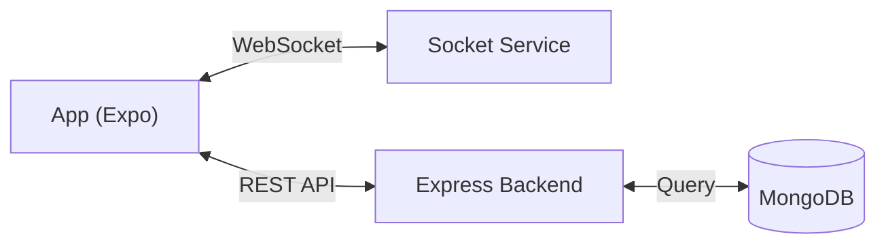

# User Notifier 🚨

**User Notifier** is a comprehensive personal safety and emergency response platform connected to a real-time command center. It bridges the gap between citizens and rapid response teams, providing tools for instant incident reporting, route safety analysis, and live emergency broadcasting.


## 🚀 Key Features

- **📍 Path Explorer:** Navigate safely with real-time route planning that visualizes safe paths and avoids high-risk zones using Google Maps integration.
- **🆘 One-Tap SOS:** Instantly report emergency incidents (Accident, Fire, Medical) with precise GPS location and priority levels.
- **⚡ Real-Time Ticker:** Stay informed with a live-streaming ticker of nearby accidents and safety alerts, powered by Socket.IO.
- **🌗 Dynamic Themes:** Seamlessly switch between System, Light, and Dark modes for optimal visibility in any environment.
- **📞 Emergency Hub:** Direct access to 24/7 customer care and essential helpline numbers.

## 🛠️ Technical Stack

| Category | Technologies |
|----------|--------------|
| **Frontend** | React Native (Expo), TypeScript, Expo Router |
| **Backend** | Node.js, Express.js |
| **Database** | MongoDB (Mongoose) |
| **Real-Time** | Socket.IO |
| **Services** | Google Maps API, Expo Location, Expo SecureStore |

## 🏗️ Architecture

The system follows a **Event-Driven Client-Server Architecture**:



For a deep dive into the system design, check out the [Architecture Documentation](./architecture.md).

## 📦 Installation & Setup

### Prerequisites
- Node.js (v18+)
- MongoDB (Running locally or Atlas URI)
- Expo Go (on mobile) or Android Studio/Xcode (for simulation)

### 1. Clone the Repository
```bash
git clone https://github.com/KmSasikumar/User_Notifier.git
cd User_Notifier
```

### 2. Backend Setup
Navigate to the `data` directory and install dependencies:
```bash
cd data
npm install
```
Create a `.env` file in `data/` with:
```env
PORT=5000
MONGO_URI=your_mongodb_connection_string
API_KEY=your_secret_api_key
JWT_SECRET=your_jwt_secret
```
Start the server:
```bash
npm start
```

### 3. Frontend Setup
Navigate back to the root and install app dependencies:
```bash
cd ..
npm install
```
Start the Expo development server:
```bash
npx expo start
```

## 🔒 Security
- **API Key Protection:** Inter-service communication is secured via `x-api-key`.
- **JWT Authentication:** User sessions are managed with robust JSON Web Tokens.

## 👨‍💻 Author

| Information | Details |
| :--- | :--- |
| **Name** | **K. SasiKumar** |
| **Registration No** | **22BCE11638** |
| **Email** | Kommamani012@gmail.com |


## 🤝 Contributing
Contributions are welcome! Please open an issue or submit a pull request for any improvements.

---
*Built with ❤️ for safer cities.*
