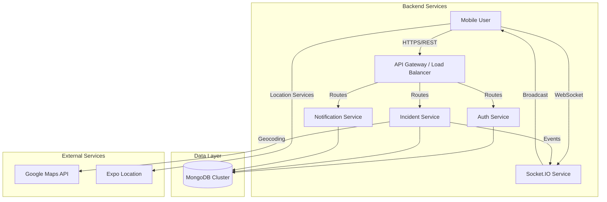
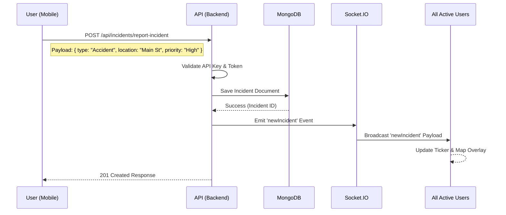

# User Notifier - System Architecture

## 1. System Overview
User Notifier is a distributed safety platform that enables real-time emergency response and situational awareness. The system follows a **Client-Server Architecture** where a React Native mobile application communicates with a Node.js/Express backend, utilizing MongoDB for persistence and Socket.IO for real-time event propagation.

## 2. High-Level Architecture Diagram

## 3. Core Components

| Component | Technology | Responsibility | Source Path |
|-----------|------------|----------------|-------------|
| **Mobile Client** | React Native (Expo) | UI/UX, Location Tracking, Incident Reporting | `app/` |
| **API Server** | Node.js / Express | Logic Processing, Auth, Data Validation | `data/server.js` |
| **Database** | MongoDB | Persistent Storage for Users & Incidents | `data/models/` |
| **Real-Time Engine** | Socket.IO | Instant Alert Broadcasting | `data/controllers/incidentController.js` |
| **Theme Engine** | Custom Context | Dynamic System/Light/Dark Mode Switching | `themes/ThemeProvider.tsx` |

## 4. Data Flow: Incident Reporting
The following sequence illustrates the lifecycle of a "High Priority" incident report:

## 5. Database Schema (Mongoose)

### **User Model** (`data/models/User.js`)
| Field | Type | Description |
|-------|------|-------------|
| `_id` | ObjectId | Unique Identifier |
| `name` | String | Full Name |
| `email` | String | Unique Email Address |
| `password` | String | Bcrypt Hashed Password |
| `location` | String | Default/Home Location |

### **Incident Model** (`data/models/Incident.js`)
| Field | Type | Description |
|-------|------|-------------|
| `_id` | ObjectId | Unique Identifier |
| `type` | String | e.g., "Accident", "Fire" |
| `location` | String | Geocoded Address or Coords |
| `timestamp` | Date | Time of Report (Default: Now) |
| `status` | String | 'active' or 'resolved' |

## 6. Technical Stack & Security

| Category | Implementation | Notes |
|----------|----------------|-------|
| **Frontend Framework** | React Native + Expo Router | Uses file-based routing and native modules |
| **Backend Runtime** | Node.js v18+ | Event-driven, non-blocking I/O |
| **API Security** | Dual-Layer Auth | `x-api-key` for service integrity + JWT for user sessions |
| **State Management** | React Context + Hooks | Lightweight state handling without Redux boilerplate |
| **Styling** | StyleSheet API + Themes | Performance-optimized styles with Zero-Runtime overhead |
